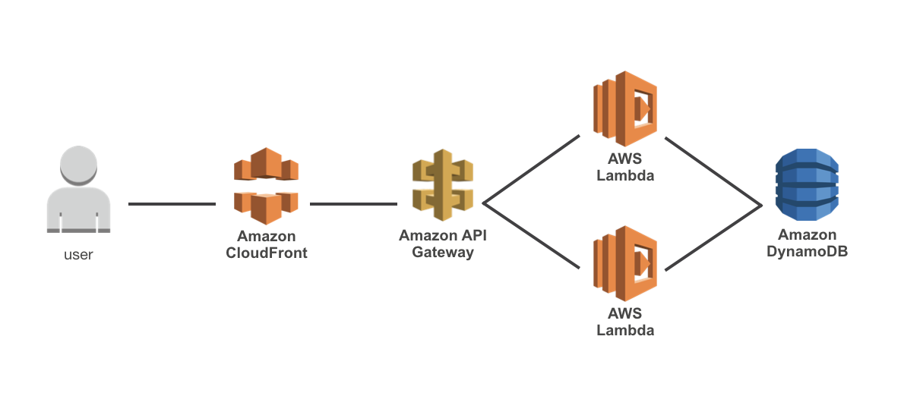
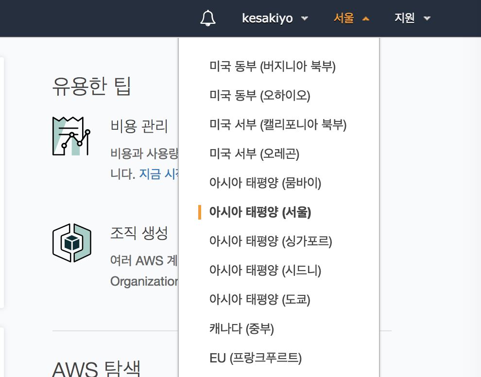

# serverless
본 문서에서는 AWS Lambda, Amazon API Gateway, Amazon DynamoDB, Amazon CloudFront를 이용해서 CRUD가 가능한 간단한 REST API를 설계하는 것을 목표로 합니다.

각각의 기능이 어떤 역할을 하는지는 본 문서에서 차례대로 설명하도록 하겠습니다. 대략적인 다이어그램은 아래와 같습니다.

본 워스샵의 아키텍처는 간단합니다. User는 CloudFront에 연결된 API GateWay에 요청을 보냅니다. 요청을 받은 API GateWay는 트리거로 설정된 Lambda를 실행하고  DaynomoDB에 데이터를 Create, Readt, Update, Delete를 합니다.

### 리전 선택
실습에 앞서 AWS 콘솔의 우측 상단의 리전 드롭다운 메뉴에서 다음 서비스를 지원하는 리전을 선택합니다.

- AWS Lambda
- Amazon API Gateway
- Amazon DynamoDB
- Amazon CloudFront

