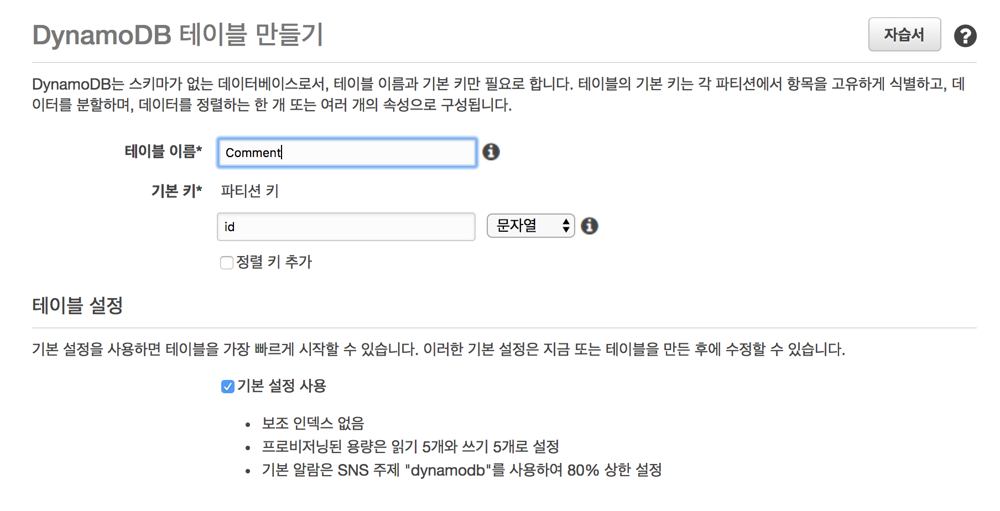
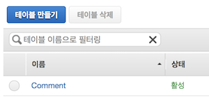
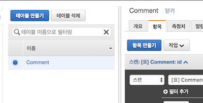
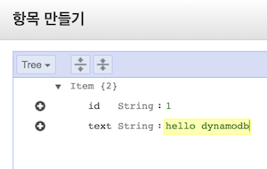
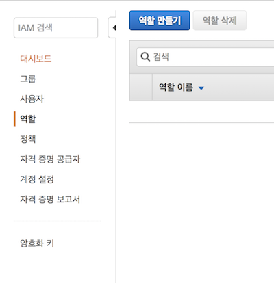
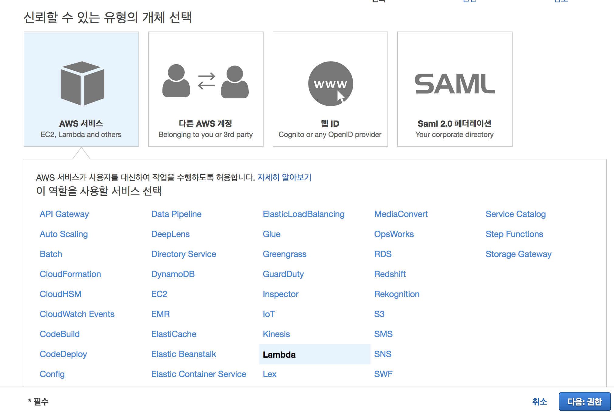
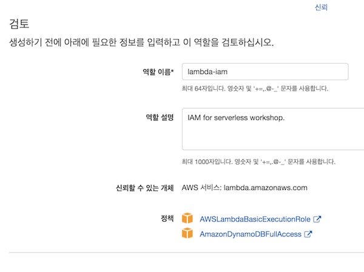
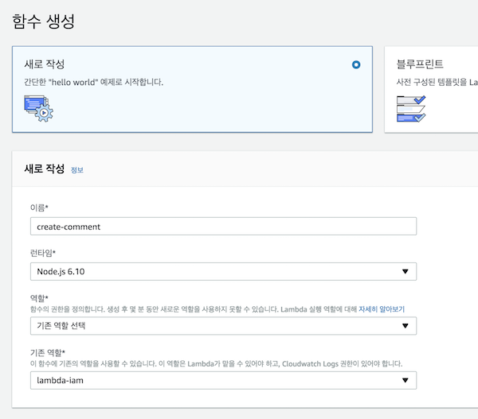
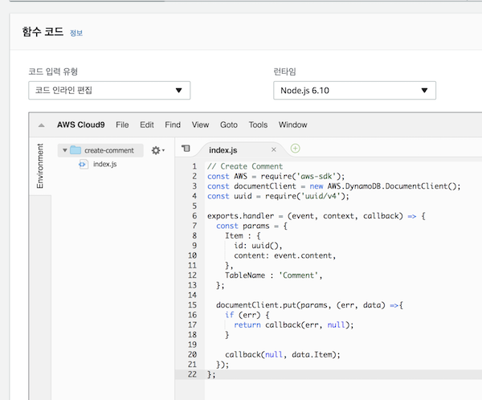
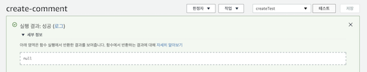

# serverless
본 문서에서는 AWS Lambda, Amazon API Gateway, Amazon DynamoDB, Amazon CloudFront를 이용해서 CRUD가 가능한 간단한 REST API를 설계하는 것을 목표로 합니다.

각각의 기능이 어떤 역할을 하는지는 본 문서에서 차례대로 설명하도록 하겠습니다. 대략적인 다이어그램은 아래와 같습니다.


본 워스샵의 아키텍처는 간단합니다. User는 CloudFront에 연결된 API GateWay에 요청을 보냅니다. 요청을 받은 API GateWay는 트리거로 설정된 Lambda를 실행하고  DaynomoDB에 데이터를 Create, Readt, Update, Delete를 합니다.

### 리전 선택
실습에 앞서 AWS 콘솔의 우측 상단의 리전 드롭다운 메뉴에서 다음 서비스를 지원하는 리전을 선택합니다.

(Seoul 리전은 위 서비스를 모두 지원합니다.)

- AWS Lambda
- Amazon API Gateway
- Amazon DynamoDB
- Amazon CloudFront


## Amazon DynamoDB

> Amazon DynamoDB는 AWS에서 NoSQL 데이터베이스입니다. 또한 완전 관리형 클라우드 데이터베이스로 안정적인 성능을 기대할 수 있습니다. 자세한 설명은 [아마존 공식 문서](https://aws.amazon.com/dynamodb)를 참고해주세요.

첫 번째로 설정해야 하는 부분은 Amazon DynamoDB입니다. 간단한 실습을 위해 "id", "text" 두 개의 키를 가지는 "Comment" 테이블을 만들어 보겠습니다.

### DynamoDB 테이블 생성
1. AWS 콘솔에서 Amazon DynamoDB를 선택합니다.
2. "테이블 만들기"를 선택합니다.
3. 테이블 이름은 "Comment", 기본 키는 "id"를 입력합니다. 그 외의 값은 기본값으로 설정합니다.



4. 생성을 클릭합니다.

테이블 생성이 완료되면 활성 상태가 된 것을 확인합니다. 활성 상태가 되기까지 보통 수 초 이내에 완료됩니다. 활성 상태가 되면 아래 그림과 같이 초록색 글씨로 "활성"이 표시 됩니다.



CRUD를 할 수 있는 테이블이 생성됐습니다!! 이제 수동으로 데이터를 추가해 보겠습니다.

### 수동으로 데이터 추가
1. Comment 테이블을 클릭합니다.
2. 상세 보기에서 "항목" - "항목 만들기" 차례로 클릭합니다.



3. id는 1을 입력합니다.
4. 왼쪽에 있는 "+"를 클릭한 뒤 "String"을 선택합니다.
5. key값은 "content"를 입력하고 내용는 "hello dynamodb"를 입력합니다.



6. 저장을 클릭합니다.

새롭게 항목이 추가된 것을 확인할 수 있습니다. 동일한 방법으로 2~3개의 아이템을 더 추가해 보세요.

## AWS Lambda
> AWS는 서버를 프로비저닝하거나 관리할 필요 없이 코드 조각을 실행하는 서비스입니다. Lambda를 실행하기 위해서는 트리거를 설정해 줘야하는데 DynamoDB, API GateWay등 다양한 서비스들과의 인테그레이션을 제공합니다. 자세한 내용은 [아마존 공식 문서](https://aws.amazon.com/lambda)를 참고해 주세요.

다음은 본 문서의 핵심 기능인 AWS Lambda 함수를 만드는 과정입니다. 이 순서에서는 총 네가지의 함수를 만듭니다. 각각의 함수는 Create, Read, Update, Delete 기능을 하게 됩니다. Lambda 함수를 만들기 전에 함수가 AWS 자원들에 접근할 수 있는 역할을 만들어 줘야 합니다.

### IAM 역할 생성
1. AWS 콘솔에서 IAM을 선택합니다.
2. "역할" - "역할 만들기"를 차례로 클릭합니다.



3. "AWS 서비스" - "Lambda"를 선택한 뒤 "다음"을 클릭합니다.



4. AWSLambdaBasicExecutionRole, AmazonDynamoDBFullAccess를 검색해 선택합니다.
5. 역할 이름은 lambda-iam 이라고 입력합니다. **정책 리스트에 4번에서 선택한 두 개가 있는지 확인합니다.**



6. 역할 만들기를 클릭합니다. 역할 리스트에서 lambda-iam 역할이 만들어진것을 확인합니다.

### Lambda 함수 생성

성공적으로 IAM 역할을 만들었으면 DynamoDB를 조작하는 Lambda 함수를 만들 차례입니다.

1. AWS 콘솔에서 AWS Lambda를 선택합니다.
2. 함수 만들기를 클릭합니다.
3. 함수 이름은 create-comment, 런타임은 Node.js 6.10, 역할은 전 순서에서 만들었던 lambda-iam을 선택합니다.



4. 함수 생성을 클릭합니다.

### Lambda 함수 코드 입력
가장 기본적인 Lambda 함수를 만들었습니다!! 이제 여러분은 이 Lambda 함수를 이용해 DynamoDB에 FullAccess를 할 수 있습니다. 이제 이 Lambda 함수를 이용해 Comment를 생성하는 기능을 구현해 보겠습니다. 

스크롤을 내이다 보면 중간쯤에 "함수 코드"라고 적혀져 있는 온라인 에디터를 볼 수 있습니다. 에디터에 아래 코드를 입력한 뒤 **우측 상단에 있는 "저장" 버튼을 클릭해주세요**



```javascript
// Create Comment
const AWS = require('aws-sdk');
const documentClient = new AWS.DynamoDB.DocumentClient();
const uuid = require('uuid/v4');

exports.handler = (event, context, callback) => {
  const params = {
    Item : {
      id: uuid(),
      content: event.content,
    },
    TableName : 'Comment',
  };

  documentClient.put(params, (err, data) => {
    if (err) {
      return callback(err, null);
    }
  
    callback(null, data.Item);
  });
};
```

> 간단한 실습을 위해 uuid 라이브러리를 사용해 id를 생성합니다. 실제 제품에서는 uuid를 id로 사용하지는 않습니다.

### Lambda 테스트 작성
코드 저장이 완료됐으면 우리가 생성한 Lambda function이 잘 동학하는지 테스트를 해 볼 차례입니다.

1. 우측 상단에 있는 테스트 버튼을 클릭합니다.
2. 적당한 테스트 이름을 입력하고 아래와 같이 테스트에 사용할 JSON 내용을 입력합니다.


```javascript
{
  "content": "My first Lambda function!!"
}
```

3. "생성" 버튼을 클릭합니다.
4. 테스트 생성이 완료되면 우측 상단에 있는 "테스트" 버튼을 눌러 테스트가 성공적으로 돌아가는지 확인합니다.
5. 아래 그림과 같이 "성공" 키워드와 함께 토스트가 보인다면 Lambda 함수가 성공적으로 생성된 것입니다.



6. DaynamoDB Comment 테이블에 새로운 항목이 생성이 된 것을 확인합니다.

### Lambda 나머지 함수 구현
성공적으로 Create Lambda 함수를 구현했으면 나머지 Read, Update, Delete 함수의 구현은 쉽습니다. **나머지 Lambda 함수를 만드는 과정은 Create Lambda 함수를 만드는 과정과 정확히 일치합니다.** 차이점이 있다면 단지 코드뿐입니다. 아래는 나머니 세 기능에 대한 코드입니다.

#### Read Lambda 함수 코드
```javascript
// Read Comments
const AWS = require('aws-sdk');
const documentClient = new AWS.DynamoDB.DocumentClient();
const uuid = require('uuid/v4');

exports.handler = (event, context, callback) => {
  const params = {
    TableName : 'Comment',
  };
  documentClient.scan(params, (err, data) => {
    if(err) {
      return callback(err, null);
    }
    callback(null, data.Items);
  });
};
```

#### Update Lambda 함수 코드
```javascript
// Update Comment
const AWS = require('aws-sdk');
const documentClient = new AWS.DynamoDB.DocumentClient();
const uuid = require('uuid/v4');

exports.handler = (event, context, callback) => {
  const params = {
    UpdateExpression: 'set content=:c',
    ExpressionAttributeValues:{
      ':c': event.content,
    },
    ReturnValues:"UPDATED_NEW",
    Key: {
      id: event.id,
    },
    TableName : 'Comment',
  };

  documentClient.update(params, (err, data) => {
    if (err) {
      return callback(err, null);
    }
    callback(null, data);
  });
};
```

#### Delete Lambda 함수 코드
```javascript
// Delete Comment
const AWS = require('aws-sdk');
const documentClient = new AWS.DynamoDB.DocumentClient();
const uuid = require('uuid/v4');

exports.handler = (event, context, callback) => {
  const params = {
    Key: {
      id: event.id,
    },
    TableName : 'Comment',
  };
	
  documentClient.delete(params, (err, data) => {
    if (err) {
      return callback(err, null);
    }

    callback(null, data);
  });
};
```

> Read, Update, Delete Lambda 함수를 성공적으로 작성했다면 Create 함수와 마찬가지로 테스트 케이스를 만들어 테스트를 합니다. 만약 코들르 잘못 입력해 동작하지 않는 것을 쉽게 찾아낼 수 있습니다.
